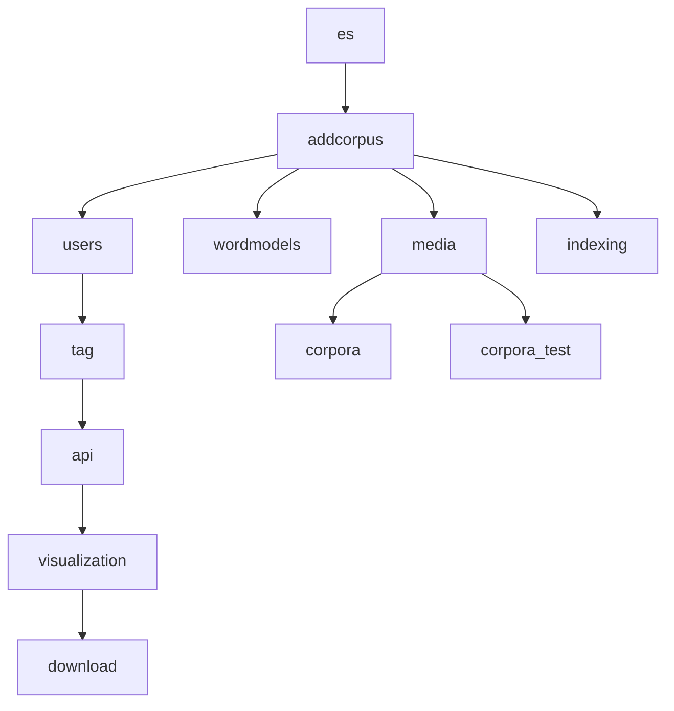

# Overview

The application consists of a backend, implemented in [Django](https://www.djangoproject.com/) and a frontend implemented in [Angular](https://angular.io/).

## Backend

The backend has three core responsibilities:
- managing the database containing information on users and access rights to corpora
- communication with Elasticsearch
- analysis tasks

### Packages

The backend consists of the following packages:

- `es`: core functionality for working with elasticsearch
- `addcorpus`: models and core functionality for corpus definitions
- `indexing`: create an index for a corpus
- `users`: user models and management
- `tag`: allow users to tag documents
- `api`: parse queries, task-related views, search history
- `visualization`: compute visualisation data
- `download`: generate and manage CSV downloads
- `media`: return media attachments for documents
- `corpora`: corpus definitions
- `corpora_test`: corpus definitions for unit tests
- `ianalyzer`: central project app

The following graph defines a rough map of the dependencies between packages.

To avoid circular imports, it's preferred that you follow the directions laid out in the graph. For example, if you want to write a function that will have something to do with tags and visualisations, add a module in `visualizations` that imports modules from `tag`, rather than vice versa.

### Database

The database uses postgreSQL. If you're not familiar with database management in a Django project, see the [Django documentation on database models](https://docs.djangoproject.com/en/5.1/topics/db/models/).

The SQL database is used to handle user-related data and corpus metadata. It does *not* store the contents of corpora; this is handled through Elasticsearch.

### Elasticsearch

Textcavator uses [Elasticsearch](https://www.elastic.co/guide/en/elasticsearch/reference/current/index.html) to manage and search the data in corpora.

Typically, you will use Textcavator to create, manage, and search an index for a corpus in Elasticsearch. (You could also use Textcavator to search an existing index, but the application is not designed for this.) Where possible, we try to rely on the search and analysis functions built into Elasticsearch, rather than build our own.

# Frontend

The frontend is an Angular web application.

The core of the frontend application is the `src/app/search/search.component`, providing the template for the user interface. This interface allows users to query results using Simple Query String syntax and offers various filters. The search component can show either the search results component, which shows documents matching the search, visualisations, or a download menu.

There are various visualizations in `src/app/visualization/`, with `visualization.component` as the main component which checks which visualization type is to be displayed. As a rule, visualisations that directly show the results of an aggregation search formulate aggregation request in the frontent, while other visualizations (wordcloudngram, term frequency) let the backend handle analysis.

For corpora with word models, the `src/app/word-models/` provides an interface with various visualisations for viewing word similarity.
